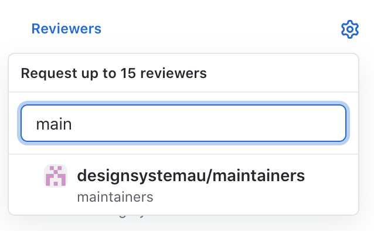
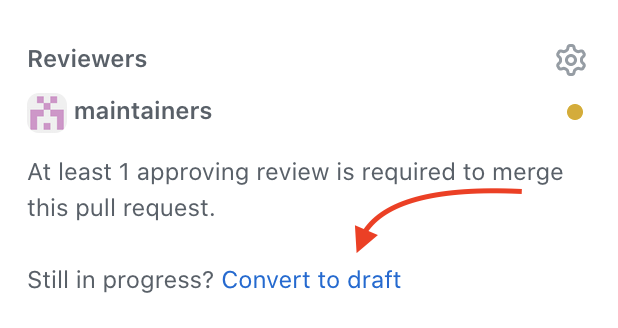

# How we do PRs

> This document outlines the procedures for shipping PRs, including the who/what/where of PR reviews.

## General principles

- We want to lean in on GitHub best practices
- We want to make asking for reviews as low friction as possible
- We want to make the expectations clear for both the reviewer and developer

## PR descriptions
It is important that the PR description captures enough information that someone coming back to the PR in 6 or 12 months can understand what was happening. This also means that the reviewer should be able to understand what’s happening today. Things which are obvious to the developer today might not be obvious to the reviewer, or the same developer in the future.

PR descriptions should never be empty

We don’t need to follow a specific template, but in general the following guidelines should be considered:

- A brief description of what changed.
- Why the change is being made (is this a new feature, a bug fix, a change in API?)
- Links to any related issues or PRs.
- Links to any relevant external documentation or resources (e.g. If you cribbed a code pattern from stack overflow or a blog post, link to source material)

The level of detail should generally be proportional to the size of the PR. A fixed typo can have a description of “fixed typo”. A new feature or complicated implementation should have significantly more details.

Changes to visual components should also contain before and after screenshots.

## Review ready checklist

Before requesting a PR review, make sure you’ve ticked off the following.

- Has a meaningful description
- Has passed CI
- Is up to date with `main`

## Requesting reviews

When a PR is ready for review, you must request a reviewer. You can either:

- Select individual reviewers if you would like a review from specific people.
- Select `designsystemau/maintainers` group if you would like a review from anyone in the Steering Committee

	

All PRs must have at least one approval unless you're writing an [RFC](https://github.com/designsystemau/RFCs).
If you request a review from two people, you only need to get approval from one of them. If you need review from both you will need to talk to them directly.

Reviewers will receive a notification in GitHub when a review has been requested either individually or as a member of the team.

It is the responsibility of all Steering Committee members to have visibility over their notifications so that developers do not have to chase up reviews.

## Revoking a request

If you as the developer decide that the PR needs more work and is no longer in a “ready for review” state, it should be converted into “draft” mode as an explicit signal that it has gone back to “in progress”. If you have a review request for a draft PR you should ignore it until the task is marked “ready for review”.

	

## Response Times

If you are waiting on a Steering Committee team review (e.g. not a specific person), you can shout out in the slack channel after a couple of days if you haven’t received any feedback.

## Merging PRs

The author is responsible for merging their own PRs once they are approved. The auto-merge feature can be enabled, which will allow the PR to be auto-merged as soon as it passes CI and is approved. In some instances the developer may want to have more control over the timing of their merge, in which case they can leave auto-merge disabled and perform the merge manually when ready. Never merge someone else's PR.

## Slack Requests

In general PR reviews should not be requested in the Slack channel, as this duplicates notification noise for the team. Reviews should only be requested in slack if a) it has been a long time since submitting your PR b) there is a specific time-critical need.

## Review best practices

As a reviewer you are responsible for the quality and correctness of the code being submitted. 
When someone made a code suggestion you agree with, try to merge the suggestion as that will give attribution to the reviewer and their work.
